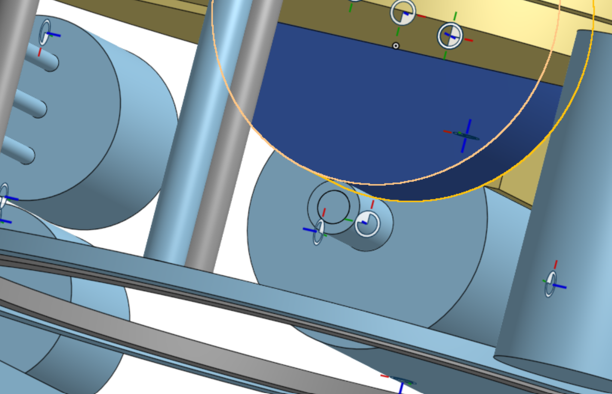
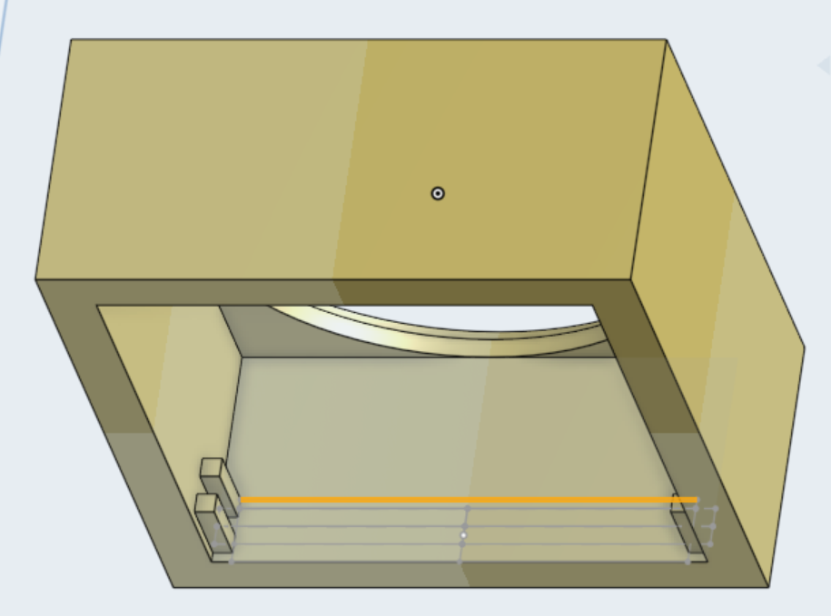
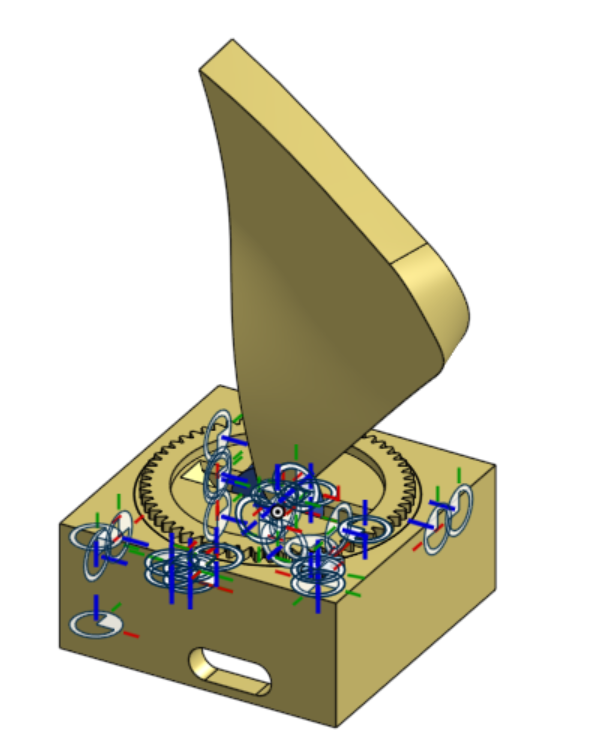

# Day 1 (June 29): Idea

So, Ahoge. There are as many types as there are... something with lots of variations. The most prominent type of ahoge is a simple lick sticking out. It may look simple (and it is) without any mechanisms, They can be tricky to manipulate to their full potential(3 joint Pitch, Yaw, etc). A simpler style for mechanisms is a Triangle or "dorito" Ahoge has more easily 2 Motions; 1 Pitch & 1 Yaw. That is what i chose.

I've now got a base of 2 DOF, How can i move it? I can use 1 Motor and a spinning platform with another, a differential System for 2 motors max Torque, arms maybe? Up to now I used the first mechanism for it's simplicity, but still thought a pulley system for pitch would be easier to implement torque wise

# Days 2-15: All Other

Done undocumented design and coding.

### Time: ~10 Hours

# Day 16 (July 14): Mechanism

Gear systems and power aren't clear yet, torque is still getting tackled, Size of gears is yet to be thought.

First thought about the motors was to use the same for all 2 systems, but as the needs of each system was different. Yaw needed less power but a smaller motor, Pitch needed stronger torque but a larger motor is ok. The mounts and placement of motors is fixed for the moment. After getting feedback and/or considering, gears could be substituted for o rings and tpu wheels or a like.

### Time: ~<1 Hour

# Day 17 (July 15): Pitch and... Fahhh!:

I realised i need to Timelapse my CAD. I Have 8+ hours of undocumented CAD. And only 2.5 Hours of Text! I'm so disappointed. today i'll probably not get much, i'm just so... idk.

What I got done:

- I made the changes to the drive system. using a 0.65:4.35 ratio on tpu wheels.

- Usd slot instead of legs for more MOSFET space. it was off .5mm at t start.

- Final design v1

### Time: ~2 Hours

# Day 18: Polish
Last day in this project. Finish all in README.

~Thank you for the ride Fictional Netizen.~

### Time: ~1 Hour 25 Minutes