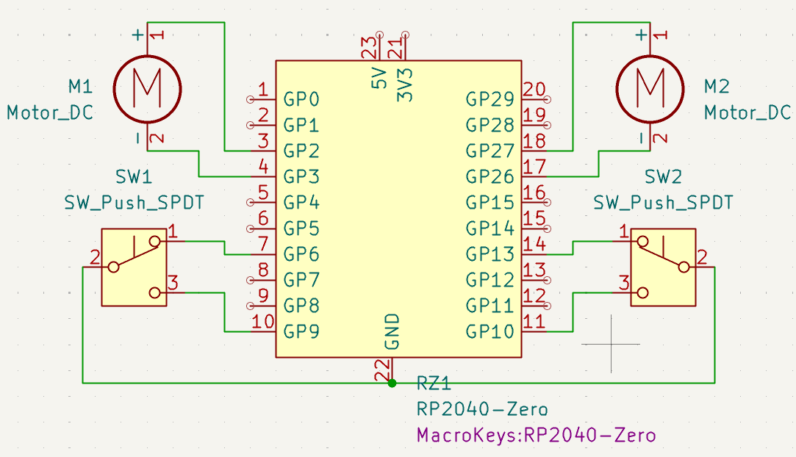

_WIP_

# Dynamic-Ahoge V1: Dorito
Ever want to express your feelings with something different? Like... Hair?(Ok, it's plastic but ...?). You can use a Dynamic ahoge to do so. this specific model can go a variety of angles and specially, spin freely to recreate a famous dorito ahoge meme!(guess)

## Features

- Small

-Pitch and Yaw(Tilt & Turn)

## TLDR of Process

The hardest part was the mechanical system. At this sal, Precise mechanical systems are rare and hard to find. Attempt at motor config and torque transfer systems were the biggst part of the deal, gears need to be made small enough easily, which is hard. 

Learn More: [Journal](/Journal/Journal.md)

## Reason
Ahoge are fun. The thing is, current ahoge technology is static, where in anime, ahoge react to moving, emotion, other people, _force majeure_ etc. The scene of deku getting shocked and showing his ahoge's bones is the first spark, and this particular design by nijika.

## Design

## Schematics

## BOM
| Name | Qty | Unit | Price | Link |
| :--- | :--- | :--- | :--- | :--- |
| 1mm Carbon Plate | 1 | Pcs@50x100x1mm | Rp. 23000 | https://www.tokopedia.com/fxsm/elektroda-plat-karbon-graphite-plate-electrode-100-x-50-x-1-10-mm-tebal-1mm-cd45b |

## AI Use
AI use in this project is for the purpose of research and ideation to speed up the development process. All work on the final product & design is all my intention.