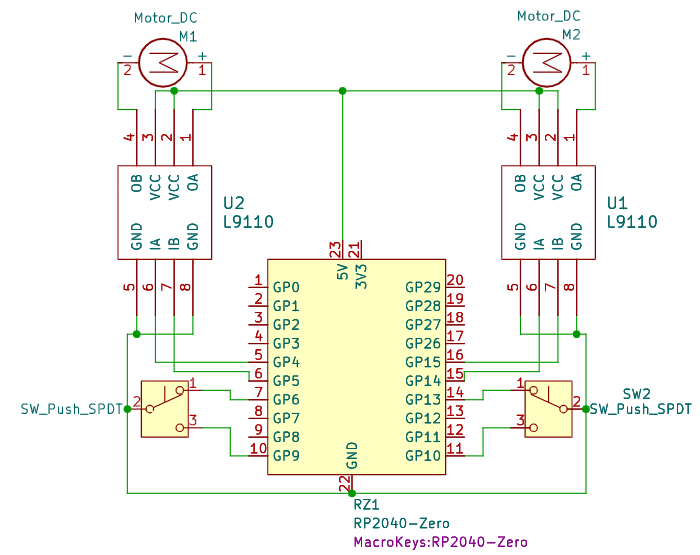

# Dynamic-Ahoge V1: Dorito
Ever want to express your feelings with something different? Like... Hair?(Ok, it's plastic but ...?). You can use a Dynamic ahoge to do so. this specific model can go a variety of angles and specially, spin freely to recreate a famous dorito ahoge meme!(guess)

## Features

- Small

-Pitch and Yaw(Tilt & Turn)

## TLDR of Process

The hardest part was the mechanical system. At this sal, Precise mechanical systems are rare and hard to find. Attempt at motor config and torque transfer systems were the biggst part of the deal, gears need to be made small enough easily, which is hard. 

Learn More: [Journal](/Journal/Journal.md)

## Reason
Ahoge are fun. The thing is, current ahoge technology is static, where in anime, ahoge react to moving, emotion, other people, _force majeure_ etc. The scene of deku getting shocked and showing his ahoge's bones is the first spark, and this particular design by nijika.

##Software
Using Arduino IDE for the rp2040 Platform.

    Feature:
    - Time Based Tracking for miniature position control(Limits not set yet)
    - Forward and Reverse of each Axis

## Design

Per part in [CAD](/cad/)

## Schematics

## BOM
|Name                  |Qty|Unit          |per Unit Price|Total Price                                  |Link                                                                                                            |
|----------------------|---|--------------|--------------|---------------------------------------------|----------------------------------------------------------------------------------------------------------------|
|1mm Carbon Plate      | 1 |Pcs@50x100x1mm|Rp. 23000     |Rp. 23000                                    |https://www.tokopedia.com/fxsm/elektroda-plat-karbon-graphite-plate-electrode-100-x-50-x-1-10-mm-tebal-1mm-cd45b|
|0610 Coreless DC Motor|1  |Pcs           |Rp. 21500     |Rp. 21500                                    |https://shopee.co.id/Dinamo-Motor-Hollow-Cup-Tipe-412-610-614-615-716-720-816-820-(8110)-i.197444648.22622463974|
|0410 Coreless DC Motor|1  |Pcs           |Rp. 12500     |Rp. 12500                                    |https://shopee.co.id/NdFeB-412-Motor-Coreless-High-Speed-Tail-Ekor-RC-Heli-i.29826435.15795356944?              |
|RP2040-Zero           |1  |Pcs           |Rp. 40000     |Rp. 40000                                    |https://tk.tokopedia.com/ZSX282N8M/                                                                             |
|BS170 Transistor      |2  |Pcs           |Rp. 3000      |Rp. 6000                                     |https://tk.tokopedia.com/ZSX2R31SR/                                                                             |
|30 AWG Wire           |3  |m             |Rp. 798       |Rp. 2394                                     |https://shopee.co.id/Kabel-AWG30-Silver-Tinned-Cu-Per-Meter-30AWG-Cable-AWG-30-AWG-Per-M                        |
|Momentary SPDT Switch |2  |Pcs           |Rp. 3500      |Rp. 7000                                     |https://shopee.co.id/product/1098736195/46003563448                                                             |
|Spring                |2  |Pcs           |$3.27         |$6.54                                        |https://www.thespringstore.com/pc007-057-6000-mw-0130-c-n-in.html?um=me                                         |
|Plate Print           |1  |Pcs           |$6.86         |$6.86                                        |https://jlc3dp.com/3d-printing-quote                                                                            |
|Dorito Print          |1  |Pcs           |$6.86         |$6.86                                        |https://jlc3dp.com/3d-printing-quote                                                                            |
|Box Print             |1  |Pcs           |$6.86         |$6.86                                        |https://jlc3dp.com/3d-printing-quote                                                                            |
|Bracket Print         |1  |Pcs           |$0.31         |$0.31                                        |https://jlc3dp.com/3d-printing-quote                                                                            |
|Rail Print            |1  |Pcs           |$0.31         |$0.31                                        |https://jlc3dp.com/3d-printing-quote                                                                            |
|Yaw Gear Print        |1  |Pcs           |$0.31         |$0.31                                        |https://jlc3dp.com/3d-printing-quote                                                                            |
|Pitch Wheel Print     |1  |Pcs           |$0.31         |$0.31                                        |https://jlc3dp.com/3d-printing-quote                                                                            |
                                                                         |

BOM: [BOM](./BOM.csv)

## AI Use
AI use in this project is for the purpose of research and ideation to speed up the development process. All work on the final product & design is all my intention.